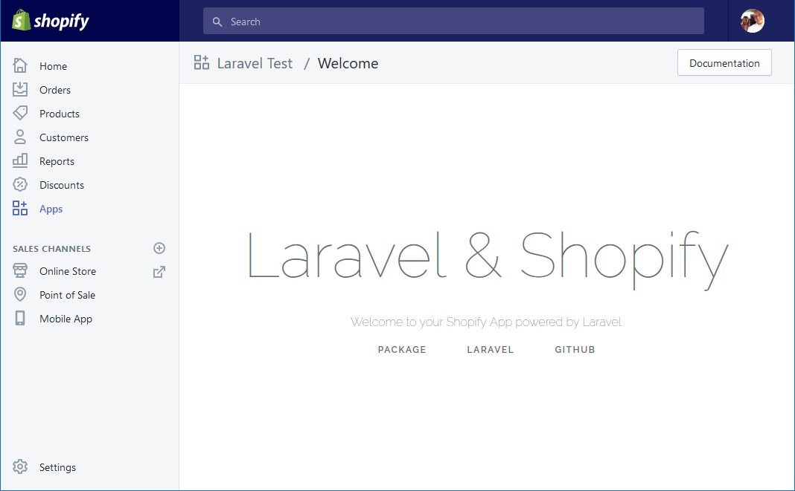
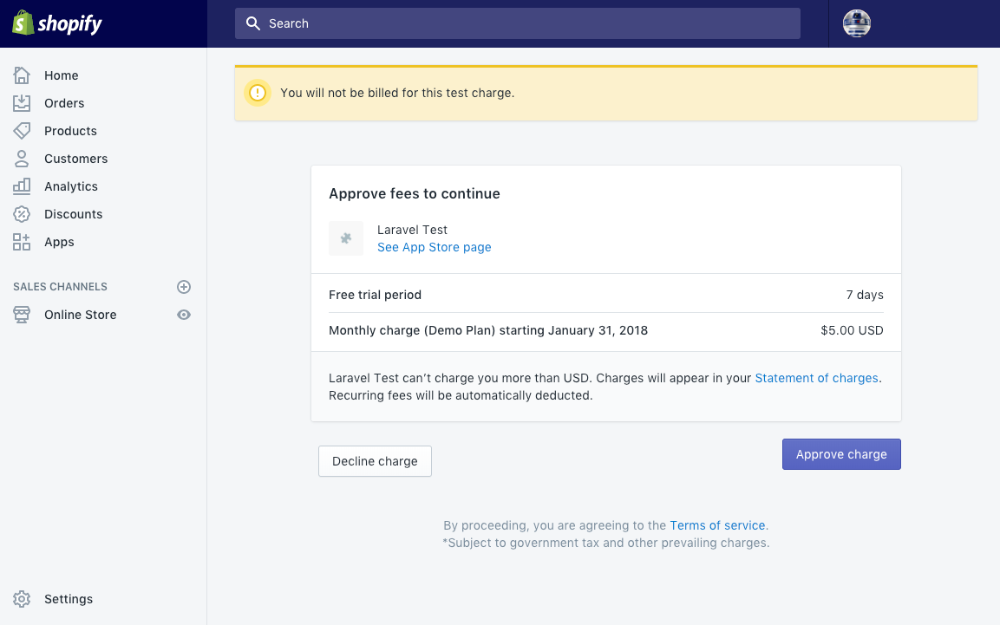

# Laravel Shopify App

----

This is a maintained version of the wonderful but now deprecated original [Laravel Shopify App](https://github.com/gnikyt/laravel-shopify/). To keep things clean, this has been detached from the original.

----

A full-featured Laravel package for aiding in Shopify App development, similar to `shopify_app` for Rails. Works for Laravel 8 and up.

## Table of Contents

__*__ *Wiki pages*

- [Goals](#goals)
- [Documentation](#documentation)
- [Installation](../../wiki/Installation)*
- [Route List](../../wiki/Route-List)*
- [Usage](../../wiki/Usage)*
- [Changelog](../../wiki/Changelog)*
- [Contributing Guide](CONTRIBUTING.md)
- [LICENSE](#license)

For more information, tutorials, etc., please view the project's [wiki](../../wiki).

## Goals

- [ ] Per User Auth Working
- [ ] Better support for SPA apps using VueJS
- [ ] Getting "Blade" templates working better with Shopify's new auth process???

## Documentation

For full resources on this package, see the [wiki](../..//wiki).

## Issue or request?

If you have found a bug or would like to request a feature for discussion, please use the `ISSUE_TEMPLATE` in this repo when creating your issue. Any issue submitted without this template will be closed.

## License

This project is released under the MIT [license](LICENSE).

## Misc

### Repository

#### Contributors

Contributions are always welcome! Contibutors are updated each release, pulled from Github. See [`CONTRIBUTORS.txt`](CONTRIBUTORS.txt).

If you're looking to become a contributor, please see [`CONTRIBUTING.md`](CONTRIBUTING.md).

#### Maintainers

Maintainers are users who manage the repository itself, whether it's managing the issues, assisting in releases, or helping with pull requests.

Currently this repository is maintained by:

- [@kyon147](https://github.com/kyon147)
- ~[@gnikyt](https://github.com/gnikyt)~ Original author of the package. See [announcement](https://github.com/gnikyt/laravel-shopify/discussions/1276) for details.

Looking to become a maintainer? E-mail @kyon147 directly.

### Special Note

I develop this package in my spare time, with a busy family/work life like many of you! So, I would like to thank everyone who's helped me out from submitting PRs, to assisting on issues, and plain using the package (I hope its useful). Cheers.
